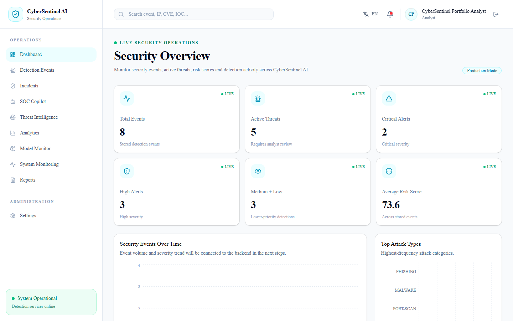
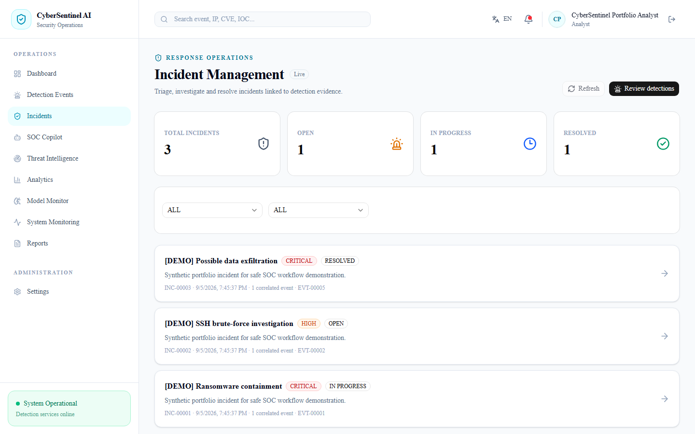
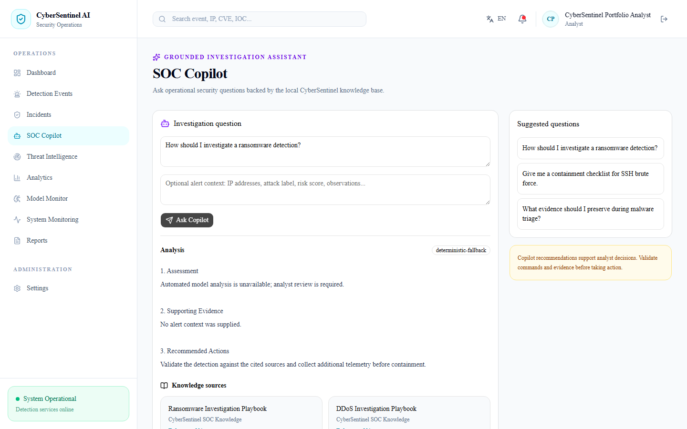
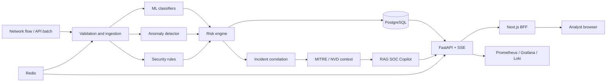

<div align="center">

# CyberSentinel AI

### AI-assisted Security Operations, from network flow to incident response

[](https://github.com/ngtd-2609/cybersentinel-ai/actions/workflows/ci.yml)
[](https://github.com/ngtd-2609/cybersentinel-ai/actions/workflows/security.yml)
[](https://www.python.org/)
[](https://fastapi.tiangolo.com/)
[](https://nextjs.org/)
[](https://docs.docker.com/compose/)
[](https://github.com/ngtd-2609/cybersentinel-ai/releases)

[**Live Demo**](https://cybersentinel-web-ppae.onrender.com) ·
[Architecture](#architecture) · [Quick Start](#quick-start) ·
[Documentation](#documentation) · [Security](SECURITY.md)

</div>

CyberSentinel AI is a full-stack defensive security portfolio project that turns
network telemetry into explainable detections, risk-ranked incidents, threat
context, and grounded SOC Copilot guidance. It combines machine learning with
deterministic security rules and human-review workflows instead of treating a
classifier prediction as a complete security decision.

The public demo is a real Next.js + FastAPI application backed by managed
PostgreSQL. It is not a static mock, and the viewer does not need Docker or a
running developer laptop.

> [!IMPORTANT]
> This is a defensive research and portfolio system, not a replacement for a
> production SIEM, EDR, IDS/IPS, SOAR, or staffed SOC. Use it only on data and
> systems you are authorized to analyze.

## Table of contents

- [Live demo](#live-demo)
- [Why this project](#why-this-project)
- [Feature tour](#feature-tour)
- [Screenshots](#screenshots)
- [Architecture](#architecture)
- [Technology stack](#technology-stack)
- [Detection and AI design](#detection-and-ai-design)
- [Model evaluation](#model-evaluation)
- [Security engineering](#security-engineering)
- [Quick start](#quick-start)
- [Local development](#local-development)
- [API overview](#api-overview)
- [Testing and release quality](#testing-and-release-quality)
- [Deployment](#deployment)
- [Repository structure](#repository-structure)
- [Documentation](#documentation)
- [Roadmap and project status](#roadmap-and-project-status)
- [Limitations](#limitations)
- [Contributing](#contributing)
- [Author and license](#author-and-license)

## Live demo

**Portfolio URL:** <https://cybersentinel-web-ppae.onrender.com>

1. Open the URL and wait for the green service-ready indicator.
2. Select **Explore with the safe demo account**.
3. Follow Dashboard → Events → Incidents → Threat Intel → Copilot → Reports.

The account is a restricted `ANALYST`; it cannot manage users or secrets. The
dataset contains eight synthetic RFC 5737 events and three demo incidents. Render
Free services can sleep when idle, so the first request may take about a minute.

| Live component | URL / provider | State |
| --- | --- | --- |
| Web application | [CyberSentinel AI](https://cybersentinel-web-ppae.onrender.com) | HTTPS, public |
| API readiness | [FastAPI `/ready`](https://cybersentinel-api-hrl8.onrender.com/ready) | PostgreSQL-aware |
| Application hosting | Render Free Web Services | Next.js BFF + FastAPI |
| Database | Neon Free PostgreSQL | Durable managed data |

## Why this project

Many intrusion-detection projects end at a notebook and an accuracy score.
CyberSentinel AI demonstrates the harder engineering around the model:

- leakage-aware, day-based CIC-IDS2017 evaluation with a locked Friday test set;
- binary classification, multiclass classification, anomaly detection, and rules;
- risk scoring that combines confidence, anomalies, indicators, and asset context;
- persisted detection events, incident workflow, timelines, and audit trails;
- MITRE ATT&CK mapping and optional NVD CVE enrichment;
- retrieval-augmented SOC guidance with evidence preservation and safe fallback;
- session rotation, RBAC, administrator MFA, lockout, rate limiting, and CORS;
- model registry, promotion gates, drift monitoring, DVC, and MLflow provenance;
- real-time ingestion, Redis-backed quotas, SSE updates, and bounded retries;
- observability, backup/restore, load testing, DAST, container scanning, and CI;
- a publicly accessible, secret-safe portfolio deployment.

## Feature tour

| Area | What a reviewer can inspect |
| --- | --- |
| Dashboard | Severity distribution, recent alerts, attack trends, and live SOC metrics |
| Detection Events | Filterable detections with risk, confidence, evidence, and traceability |
| Incidents | Status, ownership, linked detections, and investigation timeline |
| Threat Intelligence | Observed indicators, ATT&CK tactics/techniques, and defensive context |
| SOC Copilot | Grounded investigation summary, recommended actions, and knowledge sources |
| Reports | Browser-generated detection and incident CSV exports from authorized APIs |
| Model Monitor | Registry stages, model provenance, quality thresholds, and drift reports |
| Monitoring | Application health and operational signals |
| Administration | RBAC-protected users and audit logs; unavailable to the demo Analyst |

## Screenshots

<p align="center">
  
  
</p>

<p align="center">
  
</p>

The screenshots use only the synthetic portfolio dataset. A narrated 5–8 minute
video walkthrough is **planned but intentionally not part of this release gate**.

## Architecture



The browser talks to a Next.js backend-for-frontend. Session tokens remain in
HTTP-only cookies; the BFF proxies authenticated API and SSE requests. PostgreSQL
is authoritative. Redis provides distributed login quota and real-time delivery,
but portfolio mode can use bounded local fallbacks when a free provider does not
supply a worker or Redis service.

### Detection flow

```text
Raw flow → schema validation → classification + anomaly + rules
         → risk score (0–100) → severity → persistence/correlation
         → ATT&CK/CVE context → grounded analyst recommendation
```

### MLOps flow

```text
CIC-IDS2017 → day-based split → training/MLflow → DVC artifacts
            → fixed evaluation → candidate → staging → production
            → drift + analyst TP/FP feedback → promotion/archive decision
```

## Technology stack

| Layer | Technologies |
| --- | --- |
| Frontend | Next.js 16, React 19, TypeScript, Tailwind CSS, shadcn/base-ui, Recharts |
| Backend | Python 3.12, FastAPI, Pydantic, SQLAlchemy, Alembic, Uvicorn |
| Security data | PostgreSQL 16/Neon, Redis 8, Server-Sent Events |
| ML | Pandas, NumPy, scikit-learn, XGBoost, Isolation Forest, Joblib |
| AI and enrichment | TF-IDF RAG, Ollama-compatible local LLM, MITRE ATT&CK, NVD |
| MLOps | MLflow, DVC, fixed model/RAG evaluation reports |
| Observability | Prometheus, Grafana, Loki, Promtail, structured JSON logs |
| Delivery | Docker Compose, Render Blueprint, GitHub Actions, k6, OWASP ZAP, Trivy |

## Detection and AI design

### Leakage-aware evaluation

The main binary experiment uses collection days rather than a random split:

| Partition | CIC-IDS2017 days | Purpose |
| --- | --- | --- |
| Train | Monday–Wednesday | Fit preprocessing and model parameters |
| Validation | Thursday | Select threshold and compare candidates |
| Locked test | Friday | Final temporal-distribution evaluation only |

This makes distribution shift visible. It produces a less flattering but more
honest test result than choosing a threshold on the test set.

### Layered security decision

A detection is not accepted solely because an ML probability crosses a threshold.
The risk engine incorporates supervised confidence, anomaly evidence,
deterministic network signals, asset criticality, and available vulnerability
context. The result includes severity, evidence, ATT&CK context, and whether human
review is required.

### Grounded SOC Copilot

The Copilot treats questions, alerts, and retrieved documents as untrusted input.
It preserves supplied IPs/hostnames/evidence, rejects prompt-injection patterns,
does not invent IOC/CVE/ATT&CK facts, and returns a structured deterministic
fallback with sources when Ollama is unavailable. External AI and transmission of
sensitive context are disabled by default.

## Model evaluation

The fixed Phase K release report is committed at
[`reports/phase_k_ai_reliability.json`](reports/phase_k_ai_reliability.json).

| Metric | Locked Friday test |
| --- | ---: |
| Precision | 0.998898 |
| Recall | 0.279213 |
| F1 | 0.436433 |
| False-positive rate | 0.000214809 |
| ROC-AUC | 0.777590 |
| PR-AUC | 0.780250 |

The high precision and low false-positive rate come with limited recall under
temporal shift. This trade-off is documented, not hidden. The fixed RAG suite has
three adversarial/evidence cases and passes groundedness, citation accuracy,
indicator preservation, hallucination safety, and prompt-injection resistance.

## Security engineering

- short-lived access tokens and rotating refresh-token families;
- replay detection and family revocation;
- role-based authorization for Analyst, Responder, and Admin workflows;
- TOTP/recovery-code MFA for administrators;
- account lockout and Redis-backed login rate limiting;
- HTTP-only session cookies in the Next.js BFF;
- trusted-host, CORS, proxy-header, CSP, HSTS, and frame protections;
- audit events with request metadata for privileged mutations;
- public registration and API documentation disabled in portfolio mode;
- generated/provider-managed secrets—never credentials in source control;
- Bandit, pip-audit, npm audit, Trivy, secret hygiene, and OWASP ZAP in CI.

See [SECURITY.md](SECURITY.md) for reporting and supported-use guidance.

## Quick start

### Option A — use the hosted demo

Open <https://cybersentinel-web-ppae.onrender.com>. No installation is required.

### Option B — one-command local demo

Requirements: Git, Docker Engine/Desktop, Docker Compose v2, and approximately
8 GB free RAM for the complete stack.

```bash
git clone https://github.com/ngtd-2609/cybersentinel-ai.git
cd cybersentinel-ai
./scripts/start-demo.sh
```

The script creates a gitignored local secret file using cryptographic randomness,
builds the stack, migrates a fresh PostgreSQL database, inserts the safe demo
dataset, waits for readiness, and prints the URLs. Then open:

- application: <http://localhost:3002>
- API readiness: <http://localhost:8001/ready>
- Prometheus: <http://localhost:9091>
- Grafana: <http://localhost:3001> (local default `admin` / `admin`)

Stop and remove containers with:

```bash
./scripts/stop-demo.sh
```

Add `--volumes` only when you explicitly want to erase local demo databases and
monitoring volumes.

## Local development

### Prerequisites

- Python 3.12
- [uv](https://docs.astral.sh/uv/)
- Node.js 22 and npm
- PostgreSQL 16 and Redis 8, or Docker Compose

### Backend

```bash
git clone https://github.com/ngtd-2609/cybersentinel-ai.git
cd cybersentinel-ai
uv sync --locked --dev
uv run alembic upgrade head
uv run uvicorn cybersentinel_ai.api.main:app --reload --port 8001
```

Use `.env.example` as a key reference, but create your own `.env` and replace all
placeholder credentials before enabling hardened production/staging mode.

### Frontend

```bash
cd frontend
npm ci
CYBERSENTINEL_API_URL=http://localhost:8001 npm run dev -- --port 3002
```

### Optional local Ollama

The application works safely without an LLM by returning its grounded fallback.
To use a local model, run an Ollama-compatible endpoint, configure
`CYBERSENTINEL_OLLAMA_URL` and `CYBERSENTINEL_OLLAMA_MODEL`, and keep external AI
permissions disabled unless the data-handling policy has been reviewed.

## API overview

| Group | Representative routes | Protection |
| --- | --- | --- |
| Health | `GET /health`, `GET /ready`, `GET /metrics` | health public; metrics deployment-controlled |
| Authentication | `/auth/login`, refresh, logout, MFA, password change | rate limited / authenticated |
| Detections | `/events`, `/events/page`, `/events/{id}` | authenticated; writes use scoped roles/keys |
| Ingestion | batch submit, job state, dead-letter replay | ingestion API key / privileged role |
| Incidents | create, list, update, timeline | Analyst/Responder/Admin policy |
| Dashboard | `/dashboard/summary` | authenticated |
| Realtime | `/realtime/soc` | authenticated SSE |
| Copilot | `/copilot/ask` | authenticated and safety-filtered |
| MLOps | models, promotions, monitoring, feedback | authenticated; mutations role-gated |
| Administration | users, status, audit logs | Admin only |

Interactive OpenAPI documentation is available in development mode. It is hidden
on the public portfolio deployment to reduce unnecessary attack surface.

## Testing and release quality

The repository currently collects **179 Python tests** plus the Playwright browser
suite. Release checks cover:

```bash
uv run ruff check .
uv run pytest
uv run python -m cybersentinel_ai.evaluation.phase_k --check
cd frontend && npm run lint && npm run build && npm run test:e2e
```

GitHub Actions additionally verifies:

- clean fresh checkout and Phase M release metadata;
- secret hygiene and Compose/observability configuration;
- empty PostgreSQL migration, downgrade/re-upgrade, schema, and CRUD;
- API and frontend production container builds;
- Python and Node dependency audits plus Bandit SAST;
- Redis integration and rate-limit fail-closed behavior;
- Trivy critical container vulnerabilities;
- PostgreSQL backup → checksum → disposable restore;
- k6 availability/latency SLO;
- OWASP ZAP active API scan;
- no-mock public browser journey on the hosted portfolio.

The final gate and immutable evidence are documented in
[`docs/releases/v1.1.0-handoff.md`](docs/releases/v1.1.0-handoff.md) and
[`docs/releases/v1.1.0-state.json`](docs/releases/v1.1.0-state.json).

## Deployment

The official portfolio architecture uses the root [`render.yaml`](render.yaml):

```text
Internet → Render Next.js Web Service → Render FastAPI Web Service
                                      → Neon PostgreSQL
```

Render generates application secrets and receives only two user-managed values:
the Neon pooled URL and a strong demo password. Provider URLs and credentials stay
in provider secret settings. The Blueprint runs Alembic and the idempotent seed at
API startup.

For setup, recovery, cold-start, cost, and verification details, see
[`docs/portfolio-deployment.md`](docs/portfolio-deployment.md).

The Compose/Caddy staging path, immutable images, Prometheus/Grafana/Loki,
scheduled backup drills, and rollback tooling remain available as advanced SRE
evidence; a paid VPS is not required for this portfolio release.

## Repository structure

```text
cybersentinel-ai/
├── src/cybersentinel_ai/   # API, auth, ingestion, detection, MLOps, RAG
├── frontend/               # Next.js BFF, SOC UI, Playwright E2E
├── alembic/                # PostgreSQL schema migrations
├── tests/                  # unit, API, security, and integration tests
├── evaluation/             # fixed Copilot and model evaluation inputs
├── reports/                # immutable quantitative release reports
├── data/ + artifacts/      # DVC metadata; large content stays outside Git
├── monitoring/             # Prometheus, Grafana, Loki, Promtail
├── deploy/                 # Caddy/Nginx, secrets, systemd operations
├── load/                   # k6 SLO scenario
├── scripts/                # startup, release, backup, restore, rollback
├── docs/                   # deployment, SRE, and release evidence
├── render.yaml             # public portfolio Blueprint
└── docker-compose*.yml     # local, demo, staging, and production layouts
```

## Documentation

| Document | Purpose |
| --- | --- |
| [Portfolio deployment](docs/portfolio-deployment.md) | Render + Neon setup and operations |
| [Release notes](docs/releases/v1.1.0.md) | User-facing v1.1.0 changes |
| [Final handoff](docs/releases/v1.1.0-handoff.md) | Phase M Final Release Gate evidence |
| [Machine-readable state](docs/releases/v1.1.0-state.json) | Release status and evidence map |
| [SLO](docs/sre/SLO.md) | Availability and latency objectives |
| [Incident runbook](docs/sre/incident-runbook.md) | Diagnosis, containment, and recovery |
| [Phase L evidence](docs/sre/phase-l-evidence.md) | Public deployment and optional SRE proof |
| [Deploy operations](deploy/README.md) | Self-hosted staging/rollback details |
| [Changelog](CHANGELOG.md) | Version history |

## Roadmap and project status

The official implementation order was `G → H → I → J → K → L → M`; completed
phases are not replayed unless a regression is found.

- [x] G — core platform and data pipeline
- [x] H — authentication, authorization, and identity hardening
- [x] I — SOC frontend and analyst workflows
- [x] J — real-time ingestion and incident operations
- [x] K — AI reliability and MLOps lifecycle
- [x] L — public HTTPS portfolio deployment
- [x] M — final release gate and portfolio documentation
- [ ] Optional — record and publish a 5–8 minute demonstration video

## Limitations

- CIC-IDS2017 is dated and does not represent every modern network environment.
- Temporal shift produces low locked-test recall; retraining on representative,
  authorized modern telemetry would be required for operational deployment.
- ATT&CK mapping and NVD enrichment are contextual aids, not attribution proof.
- Copilot output always requires analyst judgment, even when grounded.
- The free public tier has cold starts and modest quotas; it is sized for portfolio
  review rather than production traffic.
- The repository intentionally has no declared open-source license yet. Source is
  visible for review, but reuse rights are not granted by default.

## Contributing

This is primarily a portfolio project, but well-scoped bug reports and defensive
improvements are welcome. Read [CONTRIBUTING.md](CONTRIBUTING.md), avoid sensitive
or unauthorized telemetry, and report security issues privately as described in
[SECURITY.md](SECURITY.md).

## Author and license

**Nguyễn Tùng Dương** — [GitHub @ngtd-2609](https://github.com/ngtd-2609)

No open-source license has been declared. Unless a license is added later, normal
copyright restrictions apply. The project and demo data are intended for
authorized defensive research, education, and portfolio evaluation.

## Acknowledgments

The project builds on CIC-IDS2017, MITRE ATT&CK, NVD, FastAPI, Next.js, XGBoost,
scikit-learn, MLflow, DVC, PostgreSQL, Redis, Prometheus, Grafana, Loki, Docker,
Playwright, OWASP ZAP, Trivy, and the broader open-source security community.

<p align="right"><a href="#cybersentinel-ai">Back to top ↑</a></p>
