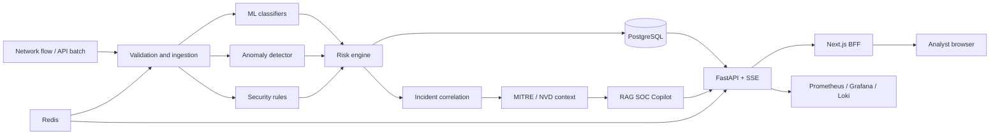

<div align="center">

# CyberSentinel AI

### Nền tảng Security Operations tích hợp AI, từ network flow đến incident response

[](https://github.com/ngtd-2609/cybersentinel-ai/actions/workflows/ci.yml)
[](https://github.com/ngtd-2609/cybersentinel-ai/actions/workflows/security.yml)
[](https://www.python.org/)
[](https://fastapi.tiangolo.com/)
[](https://nextjs.org/)
[](https://docs.docker.com/compose/)
[](https://github.com/ngtd-2609/cybersentinel-ai/releases)

[**Live Demo**](https://cybersentinel-ai-dun.vercel.app) ·
[Kiến trúc](#architecture) · [Khởi động nhanh](#quick-start) ·
[Tài liệu](#documentation) · [Security Policy](SECURITY.md)

</div>

CyberSentinel AI là dự án portfolio về defensive security theo kiến trúc full-stack,
biến network telemetry thành detection có khả năng giải thích, incident được xếp hạng
rủi ro, threat context và hướng dẫn điều tra từ SOC Copilot. Hệ thống kết hợp Machine
Learning với deterministic security rules và quy trình human review, thay vì xem kết
quả dự đoán của classifier là một quyết định bảo mật hoàn chỉnh.

Live Demo là ứng dụng Next.js + FastAPI thực sự, sử dụng managed PostgreSQL. Đây không
phải frontend tĩnh hoặc mock demo; người xem không cần cài Docker hay duy trì laptop
của tác giả ở trạng thái hoạt động.

> [!IMPORTANT]
> Đây là hệ thống nghiên cứu defensive security và portfolio, không thay thế cho
> production SIEM, EDR, IDS/IPS, SOAR hoặc một SOC có nhân sự vận hành. Chỉ sử dụng
> với dữ liệu và hệ thống mà bạn được phép phân tích.

## Mục lục

- [Live Demo](#live-demo)
- [Lý do xây dựng](#why-this-project)
- [Các tính năng chính](#feature-tour)
- [Ảnh giao diện](#screenshots)
- [Kiến trúc](#architecture)
- [Technology Stack](#technology-stack)
- [Thiết kế Detection và AI](#detection-and-ai-design)
- [Đánh giá mô hình](#model-evaluation)
- [Security Engineering](#security-engineering)
- [Khởi động nhanh](#quick-start)
- [Phát triển cục bộ](#local-development)
- [Tổng quan API](#api-overview)
- [Kiểm thử và chất lượng release](#testing-and-release-quality)
- [Deployment](#deployment)
- [Cấu trúc repository](#repository-structure)
- [Tài liệu](#documentation)
- [Roadmap và trạng thái dự án](#roadmap-and-project-status)
- [Giới hạn hiện tại](#limitations)
- [Đóng góp](#contributing)
- [Tác giả và giấy phép](#author-and-license)

<a id="live-demo"></a>

## Live Demo

**Portfolio URL:** <https://cybersentinel-ai-dun.vercel.app>

1. Mở URL và đợi service-ready indicator chuyển sang màu xanh.
2. Chọn **Explore with the safe demo account** hoặc tự đăng ký tài khoản.
3. Trải nghiệm theo luồng Dashboard → Events → Incidents → Threat Intel → Copilot → Reports.

Mọi tài khoản public đều có role `VIEWER`. Người dùng có thể xem shared evidence ở
chế độ read-only và thực hiện analyst actions trong private sandbox của chính mình.
Họ không thể thay đổi canonical demo incidents, quản lý người dùng hoặc truy cập
secrets. Chức năng đăng ký mới được rate limit và giới hạn capacity. Demo dataset gồm
tám sự kiện tổng hợp sử dụng địa chỉ RFC 5737, ba asset và một kịch bản tấn công tương
quan từ sáu detection. Render Free có thể sleep khi không hoạt động, vì vậy request
đầu tiên đôi lúc cần khoảng một phút.

| Thành phần | URL / Provider | Trạng thái |
| --- | --- | --- |
| Web application | [CyberSentinel AI](https://cybersentinel-ai-dun.vercel.app) | Vercel HTTPS, public |
| Web fallback | [Render frontend](https://cybersentinel-web-ppae.onrender.com) | HTTPS, public |
| API readiness | [FastAPI `/ready`](https://cybersentinel-api-hrl8.onrender.com/ready) | Kiểm tra cả PostgreSQL |
| Application hosting | Vercel + Render Free | Next.js BFF + FastAPI |
| Database | Neon Free PostgreSQL | Managed persistent data |

<a id="why-this-project"></a>

## Lý do xây dựng

Nhiều dự án intrusion detection chỉ dừng ở notebook và một chỉ số accuracy.
CyberSentinel AI tập trung thể hiện phần engineering khó hơn xung quanh mô hình:

- đánh giá CIC-IDS2017 theo ngày, có kiểm soát data leakage và khóa Friday test set;
- binary classification, multiclass classification, anomaly detection và rules;
- risk scoring kết hợp confidence, anomaly, indicator và asset context;
- lưu trữ detection event, incident workflow, timeline và audit trail;
- ánh xạ MITRE ATT&CK và enrichment NVD CVE tùy chọn;
- SOC guidance theo Retrieval-Augmented Generation, giữ nguyên evidence và có safe fallback;
- session rotation, RBAC, MFA cho administrator, lockout, rate limiting và CORS;
- model registry, promotion gate, drift monitoring, DVC và MLflow provenance;
- real-time ingestion, quota qua Redis, SSE update và bounded retry;
- observability, backup/restore, load testing, DAST, container scanning và CI;
- public portfolio deployment có thể truy cập trực tiếp và không để lộ secret.

<a id="feature-tour"></a>

## Các tính năng chính

| Khu vực | Nội dung người xem có thể trải nghiệm |
| --- | --- |
| Dashboard | Phân bố severity, alert gần đây, attack trend và live SOC metrics |
| Detection Events | Tìm kiếm, phân trang detection và năm kịch bản simulation an toàn |
| Incidents | Case ID, priority, asset, related detection, workflow, timeline và private sandbox actions |
| Threat Intelligence | MITRE context và AbuseIPDB IP reputation được cache, có graceful fallback |
| SOC Copilot | Tóm tắt điều tra có grounding, đề xuất hành động và knowledge sources |
| Reports | Xuất detection và incident CSV từ authorized API ngay trên browser |
| Model Monitor | Registry stage, model provenance, quality threshold và drift report |
| Monitoring | Application health và operational signals |
| Trải nghiệm | Self-registration, private sandbox 72 giờ, i18n, alert status thực và password settings |
| Administration | User management, role, account status và attributable audit log được bảo vệ bởi RBAC |

<a id="screenshots"></a>

## Ảnh giao diện

<p align="center">
  
  
</p>

<p align="center">
  
</p>

Các screenshot chỉ sử dụng synthetic portfolio dataset. Video walkthrough dài 5–8
phút đang nằm trong kế hoạch và **chưa phải một phần của release gate hiện tại**.

<a id="architecture"></a>

## Kiến trúc



Browser giao tiếp với Next.js Backend-for-Frontend (BFF). Session token chỉ được lưu
trong HTTP-only cookie; BFF proxy các API request và SSE request đã xác thực.
PostgreSQL là nguồn dữ liệu authoritative. Redis cung cấp distributed login quota và
real-time delivery; portfolio mode có thể dùng bounded local fallback khi free provider
không cung cấp worker hoặc Redis service.

### Detection flow

```text
Raw flow → schema validation → classification + anomaly + rules
         → risk score (0–100) → severity → persistence/correlation
         → ATT&CK/CVE context → grounded analyst recommendation
```

### MLOps flow

```text
CIC-IDS2017 → day-based split → training/MLflow → DVC artifacts
            → fixed evaluation → candidate → staging → production
            → drift + analyst TP/FP feedback → promotion/archive decision
```

<a id="technology-stack"></a>

## Technology Stack

| Layer | Công nghệ |
| --- | --- |
| Frontend | Next.js 16, React 19, TypeScript, Tailwind CSS, shadcn/base-ui, Recharts |
| Backend | Python 3.12, FastAPI, Pydantic, SQLAlchemy, Alembic, Uvicorn |
| Security data | PostgreSQL 16/Neon, Redis 8, Server-Sent Events |
| Machine Learning | Pandas, NumPy, scikit-learn, XGBoost, Isolation Forest, Joblib |
| AI và enrichment | TF-IDF RAG, Ollama-compatible local LLM, MITRE ATT&CK, NVD, AbuseIPDB adapter/cache |
| MLOps | MLflow, DVC, fixed model/RAG evaluation reports |
| Observability | Prometheus, Grafana, Loki, Promtail, structured JSON logs |
| Delivery | Docker Compose, Render Blueprint, GitHub Actions, k6, OWASP ZAP, Trivy |

<a id="detection-and-ai-design"></a>

## Thiết kế Detection và AI

### Đánh giá có kiểm soát data leakage

Binary experiment chính chia dữ liệu theo ngày thu thập thay vì random split:

| Partition | Ngày trong CIC-IDS2017 | Mục đích |
| --- | --- | --- |
| Train | Monday–Wednesday | Fit preprocessing và model parameters |
| Validation | Thursday | Chọn threshold và so sánh candidate |
| Locked test | Friday | Chỉ dùng để đánh giá temporal distribution cuối cùng |

Cách chia này làm distribution shift hiện rõ. Kết quả có thể kém đẹp hơn, nhưng trung
thực hơn so với việc lựa chọn threshold trực tiếp trên test set.

### Quyết định bảo mật nhiều lớp

Một detection không được chấp nhận chỉ vì ML probability vượt threshold. Risk engine
kết hợp supervised confidence, anomaly evidence, deterministic network signal, asset
criticality và vulnerability context hiện có. Kết quả bao gồm severity, evidence,
ATT&CK context và trạng thái yêu cầu human review.

### Grounded SOC Copilot

Copilot xem câu hỏi, alert và retrieved document là untrusted input. Hệ thống giữ
nguyên IP, hostname và evidence được cung cấp; chặn prompt-injection pattern; không tự
bịa IOC, CVE hoặc ATT&CK fact; đồng thời trả structured deterministic fallback kèm
source khi Ollama không khả dụng. External AI và việc truyền sensitive context bị tắt
theo mặc định.

<a id="model-evaluation"></a>

## Đánh giá mô hình

Fixed Phase K release report được lưu tại
[`reports/phase_k_ai_reliability.json`](reports/phase_k_ai_reliability.json).

| Metric | Locked Friday test |
| --- | ---: |
| Precision | 0.998898 |
| Recall | 0.279213 |
| F1 | 0.436433 |
| False-positive rate | 0.000214809 |
| ROC-AUC | 0.777590 |
| PR-AUC | 0.780250 |

Precision cao và false-positive rate thấp phải đánh đổi bằng recall còn hạn chế khi
có temporal shift. Trade-off này được công khai thay vì che giấu. Fixed RAG suite gồm
ba adversarial/evidence case và kiểm tra groundedness, citation accuracy, indicator
preservation, hallucination safety cùng prompt-injection resistance.

<a id="security-engineering"></a>

## Security Engineering

- access token ngắn hạn và rotating refresh-token family;
- phát hiện replay và thu hồi toàn bộ token family;
- role-based authorization cho các workflow Analyst, Responder và Admin;
- TOTP/recovery-code MFA dành cho administrator;
- account lockout và login rate limiting qua Redis;
- HTTP-only session cookie trong Next.js BFF;
- trusted host, CORS, proxy header, CSP, HSTS và frame protection;
- audit event có request metadata cho privileged mutation;
- public registration chỉ tạo role Viewer, rate limit theo IP và giới hạn capacity;
- tắt public API documentation trong portfolio mode;
- secret do provider tạo hoặc quản lý, không lưu credential trong source control;
- Bandit, pip-audit, npm audit, Trivy, secret hygiene và OWASP ZAP trong CI.

Xem [SECURITY.md](SECURITY.md) để biết cách báo cáo vulnerability và phạm vi sử dụng
được hỗ trợ.

<a id="quick-start"></a>

## Khởi động nhanh

### Lựa chọn A — sử dụng Live Demo

Mở <https://cybersentinel-ai-dun.vercel.app>. Không cần cài đặt.

### Lựa chọn B — chạy local demo bằng một command

Yêu cầu: Git, Docker Engine/Desktop, Docker Compose v2 và khoảng 8 GB RAM trống cho
toàn bộ stack.

```bash
git clone https://github.com/ngtd-2609/cybersentinel-ai.git
cd cybersentinel-ai
./scripts/start-demo.sh
```

Script tự tạo local secret file đã nằm trong `.gitignore` bằng cryptographic random,
build stack, migrate database PostgreSQL mới, seed safe demo dataset, chờ readiness và
in các URL cần thiết. Sau đó mở:

- application: <http://localhost:3002>
- API readiness: <http://localhost:8001/ready>
- Prometheus: <http://localhost:9091>
- Grafana: <http://localhost:3001> — local default `admin` / `admin`

Dừng và xóa container bằng:

```bash
./scripts/stop-demo.sh
```

Chỉ thêm `--volumes` khi bạn thực sự muốn xóa local demo database và monitoring volume.

<a id="local-development"></a>

## Phát triển cục bộ

### Prerequisites

- Python 3.12
- [uv](https://docs.astral.sh/uv/)
- Node.js 22 và npm
- PostgreSQL 16 và Redis 8, hoặc Docker Compose

### Backend

```bash
git clone https://github.com/ngtd-2609/cybersentinel-ai.git
cd cybersentinel-ai
uv sync --locked --dev
uv run alembic upgrade head
uv run uvicorn cybersentinel_ai.api.main:app --reload --port 8001
```

Dùng `.env.example` để tham khảo key, nhưng hãy tạo `.env` riêng và thay toàn bộ
placeholder credential trước khi bật hardened production/staging mode.

### Frontend

```bash
cd frontend
npm ci
CYBERSENTINEL_API_URL=http://localhost:8001 npm run dev -- --port 3002
```

### Local Ollama tùy chọn

Ứng dụng vẫn hoạt động an toàn khi không có LLM nhờ grounded fallback. Để dùng local
model, hãy chạy Ollama-compatible endpoint, cấu hình `CYBERSENTINEL_OLLAMA_URL` và
`CYBERSENTINEL_OLLAMA_MODEL`. Chỉ bật quyền sử dụng external AI sau khi đã xem xét
data-handling policy.

<a id="api-overview"></a>

## Tổng quan API

| Nhóm | Representative routes | Cơ chế bảo vệ |
| --- | --- | --- |
| Health | `GET /health`, `GET /ready`, `GET /metrics` | Health public; metrics do deployment kiểm soát |
| Authentication | `/auth/login`, refresh, logout, MFA, password change | Rate limit / yêu cầu authentication |
| Detections | `/events`, `/events/page`, `/events/simulate`, sandbox reset | Authenticated; Viewer được dùng controlled simulation |
| Ingestion | Batch submit, job state, dead-letter replay | Ingestion API key / privileged role |
| Incidents | Create, combined filter, case update, timeline | Role policy; Viewer chỉ ghi vào sandbox của mình |
| Investigation | Asset, cached IP reputation, simulated response action | Authenticated; mutation được scope check |
| Dashboard | `/dashboard/summary` | Authenticated |
| Realtime | `/realtime/soc` | Authenticated SSE |
| Copilot | `/copilot/ask` | Authenticated và safety filtered |
| MLOps | Model, promotion, monitoring, feedback | Authenticated; mutation có role gate |
| Administration | Create/list user, role/status, audit log | Chỉ Admin |

Interactive OpenAPI documentation khả dụng trong development mode và được ẩn trên
public portfolio deployment để giảm attack surface không cần thiết.

<a id="testing-and-release-quality"></a>

## Kiểm thử và chất lượng release

Backend suite hiện đạt **192 tests passed** và có **2 environment-specific skips**;
frontend có Playwright browser suite riêng. Các release check chính gồm:

```bash
uv run ruff check .
uv run pytest
uv run python -m cybersentinel_ai.evaluation.phase_k --check
cd frontend && npm run lint && npm run build && npm run test:e2e
```

GitHub Actions còn xác minh:

- clean fresh checkout và Phase M release metadata;
- secret hygiene và cấu hình Compose/observability;
- migration trên PostgreSQL rỗng, downgrade/re-upgrade, schema và CRUD;
- production container build cho API và frontend;
- dependency audit cho Python/Node và Bandit SAST;
- Redis integration cùng hành vi rate-limit fail-closed;
- critical container vulnerability bằng Trivy;
- PostgreSQL backup → checksum → disposable restore;
- availability/latency SLO bằng k6;
- active API scan bằng OWASP ZAP;
- public browser journey không dùng mock trên hosted portfolio.

Final gate và immutable evidence được ghi tại
[`docs/releases/v1.2.0-handoff.md`](docs/releases/v1.2.0-handoff.md) và
[`docs/releases/v1.2.0-state.json`](docs/releases/v1.2.0-state.json).

<a id="deployment"></a>

## Deployment

Kiến trúc public portfolio sử dụng Vercel cho Next.js/BFF frontend và file
[`render.yaml`](render.yaml) ở repository root cho API:

```text
Internet → Vercel Next.js/BFF → Render FastAPI Web Service → Neon PostgreSQL
```

Render tự tạo application secret và nhận ba giá trị do người dùng quản lý: Neon pooled
URL, demo password mạnh và một Owner Admin password riêng. Provider URL và credential
được lưu trong provider secret settings. Blueprint chạy Alembic và idempotent seed khi
API khởi động.

File [`frontend/vercel.json`](frontend/vercel.json) định nghĩa Vercel frontend build.
FastAPI tiếp tục chạy trên Render và PostgreSQL trên Neon; Render-hosted frontend được
giữ lại làm fallback.

Xem [`docs/portfolio-deployment.md`](docs/portfolio-deployment.md) để biết chi tiết về
setup, recovery, cold start, chi phí và verification.

Compose/Caddy staging path, immutable image, Prometheus/Grafana/Loki, scheduled backup
drill và rollback tooling vẫn được giữ làm bằng chứng SRE nâng cao; portfolio release
không bắt buộc phải thuê VPS.

<a id="repository-structure"></a>

## Cấu trúc repository

```text
cybersentinel-ai/
├── src/cybersentinel_ai/   # API, auth, ingestion, detection, MLOps, RAG
├── frontend/               # Next.js BFF, SOC UI, Playwright E2E
├── alembic/                # PostgreSQL schema migrations
├── tests/                  # unit, API, security và integration tests
├── evaluation/             # fixed Copilot và model evaluation inputs
├── reports/                # immutable quantitative release reports
├── data/ + artifacts/      # DVC metadata; large content nằm ngoài Git
├── monitoring/             # Prometheus, Grafana, Loki, Promtail
├── deploy/                 # Caddy/Nginx, secret và systemd operations
├── load/                   # k6 SLO scenario
├── scripts/                # startup, release, backup, restore, rollback
├── docs/                   # deployment, SRE và release evidence
├── render.yaml             # public portfolio Blueprint
└── docker-compose*.yml     # local, demo, staging và production layouts
```

<a id="documentation"></a>

## Tài liệu

| Tài liệu | Mục đích |
| --- | --- |
| [Portfolio deployment](docs/portfolio-deployment.md) | Thiết lập và vận hành Render + Neon |
| [Release notes](docs/releases/v1.2.0.md) | Các thay đổi hướng tới người dùng trong v1.2.0 |
| [Final handoff](docs/releases/v1.2.0-handoff.md) | Bằng chứng cho Phase M Final Release Gate |
| [Machine-readable state](docs/releases/v1.2.0-state.json) | Release status và evidence map |
| [SLO](docs/sre/SLO.md) | Mục tiêu availability và latency |
| [Incident runbook](docs/sre/incident-runbook.md) | Diagnosis, containment và recovery |
| [Phase L evidence](docs/sre/phase-l-evidence.md) | Public deployment và bằng chứng SRE tùy chọn |
| [Deploy operations](deploy/README.md) | Chi tiết self-hosted staging/rollback |
| [Changelog](CHANGELOG.md) | Lịch sử phiên bản |


<a id="limitations"></a>

## Giới hạn hiện tại

- CIC-IDS2017 đã cũ và không đại diện cho mọi network environment hiện đại.
- Temporal shift làm locked-test recall còn thấp; operational deployment cần retrain
  trên representative telemetry hiện đại và được thu thập hợp pháp.
- ATT&CK mapping và NVD enrichment chỉ cung cấp context, không phải attribution proof.
- Copilot output luôn cần analyst judgment, kể cả khi đã được grounding.
- Free public tier có cold start và quota giới hạn; hệ thống được sizing cho portfolio
  review, không phải production traffic.
- Repository chủ ý chưa khai báo open-source license. Source code được công khai để
  review nhưng mặc định không cấp quyền tái sử dụng.

<a id="contributing"></a>

## Đóng góp

Đây chủ yếu là portfolio project, nhưng các bug report có phạm vi rõ ràng và cải tiến
defensive security đều được chào đón. Hãy đọc [CONTRIBUTING.md](CONTRIBUTING.md), không
gửi telemetry nhạy cảm hoặc trái phép và báo cáo security issue theo kênh riêng được
mô tả trong [SECURITY.md](SECURITY.md).

<a id="author-and-license"></a>

## Tác giả và giấy phép

**Nguyễn Tùng Dương** — [GitHub @ngtd-2609](https://github.com/ngtd-2609)

Dự án hiện chưa khai báo open-source license. Cho đến khi license được bổ sung, các
quy định bản quyền thông thường vẫn được áp dụng. Project và demo data dành cho
authorized defensive research, giáo dục và portfolio evaluation.

## Lời cảm ơn

Dự án sử dụng và học hỏi từ CIC-IDS2017, MITRE ATT&CK, NVD, FastAPI, Next.js, XGBoost,
scikit-learn, MLflow, DVC, PostgreSQL, Redis, Prometheus, Grafana, Loki, Docker,
Playwright, OWASP ZAP, Trivy và cộng đồng open-source security.

<p align="right"><a href="#cybersentinel-ai">Về đầu trang ↑</a></p>
